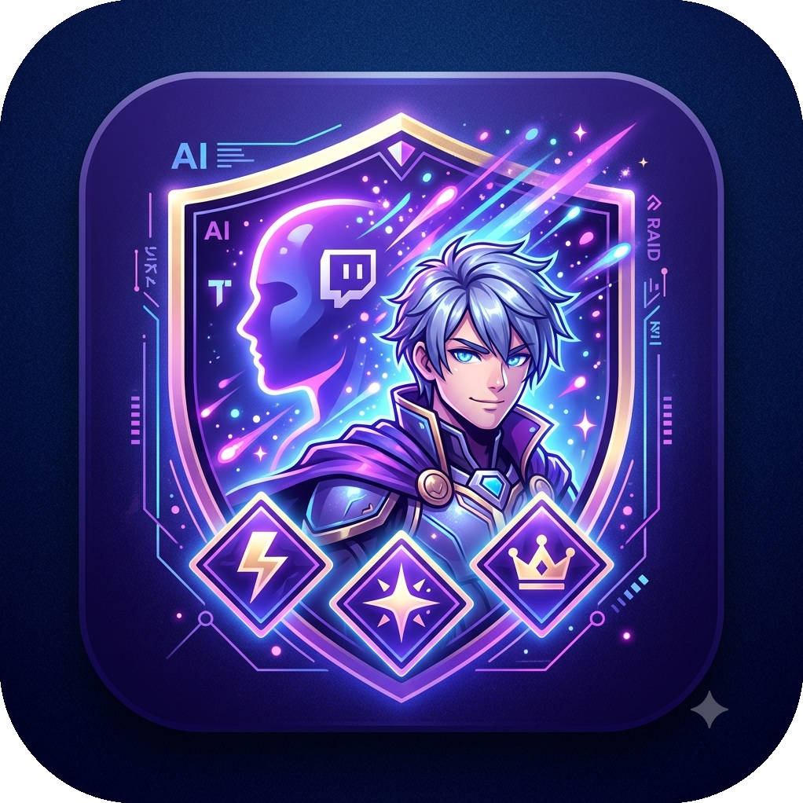
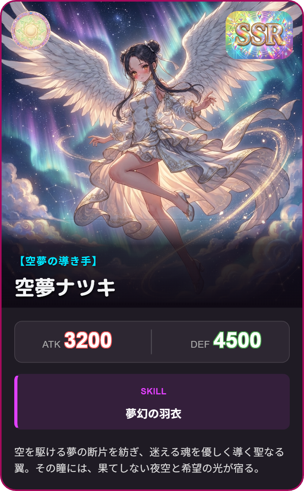
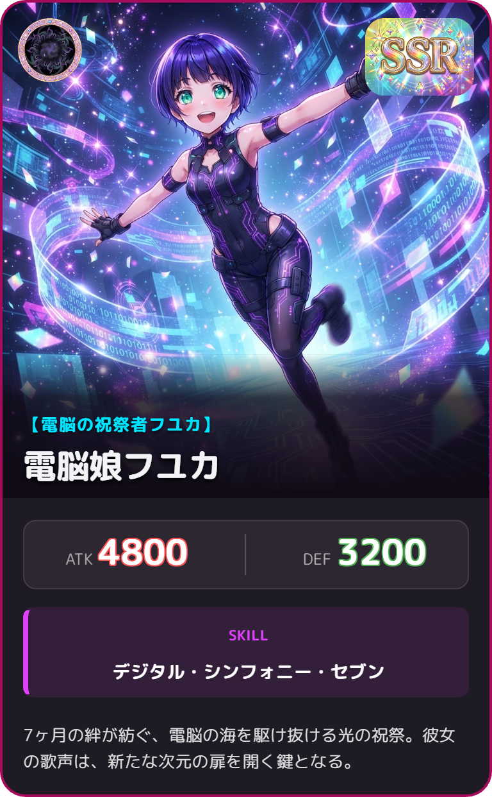

# Twitch AI カードメーカー ナツ



「リスナーの応援が、世界に一枚だけの『最強トレカ』になる。」
Twitch AI Card Generatorは、あなたの配信で起きた熱いイベント（レイド、サブスク、ビッツなど）。リスナーのアイコンをベースにしたハイクオリティなソーシャルゲーム風キャラクターカードをリアルタイムで錬成する、配信演出システムです！

## ✨ どんなことができるの？
管理画面からユーザー情報やカードの種類を選択し生成！バックグラウンドでAIが動き出し、世界に一つだけのカードを作り出します。

## 🎨 アイコンが美麗イラストに転生
リスナーのTwitchプロフィールアイコンの雰囲気やモチーフ、魂を受け継いだまま、圧倒的クオリティのアニメ風イラストへ描き替えます。

## 🔥 イベントの「熱量」がエフェクトになる

レイド（Raid）： 引き連れてきた視聴者数（軍勢）に応じて、構図がドラマチックに！

サブスク（Subscription）： 継続月数が増えるほど、衣装や背景がお祝いモードで豪華に！

ビッツ（Cheer）： 投げ銭の金額が大きくなるほど、画面を覆いつくすド派手な魔法やオーラが炸裂！

## 🎬 配信画面にそのまま出現
完成したカードは、そのまま配信画面（OBS等）にエフェクト付きでかっこよくポップアップ！配信の盛り上がりを最高潮に引き上げます。

## 🛠️ コントロールパネルで自由自在
専用の管理画面から、いつでもお気に入りの過去カードを再表示（リポスト）したり、手動でド派手な演出のテストを行うことができます。

## 📸 ギャラリー（イメージ）
配信画面に以下のようなカードがリアルタイムで登場し、リスナーのエンゲージメントを爆発させます。

💡 カード演出の例:

 

## ⁉️必要なもの

- Google Gemini APIの有料キー(無料キーでは利用できません)

## ⚡ 動作の仕組み（かんたん図解）
リスナーが応援！（レイド・サブスク・投げ銭など）

システムが自動検知！（Twitch Botがイベントをキャッチ）

AIがカードを錬成！（アイコンと熱量を元にイラストとステータスを生成）

配信画面にドーン！（React製の美麗なUIがOBS上にリアルタイム出現）

## 🎨 開発者の方へ
このプロジェクトは、Python（Twitch Bot / FastAPI）と React（フロントエンド）のハイブリッドで構築されています。

バックエンドでTwitchのイベントや画像生成AI（Banana API）をコントロール。

フロントエンドで高精度なデザイン描画と自動撮影を行い、即座に画像データとしてローカルにアーカイブされます。

## 😇 作者

空夢(そらゆめ)ナツキ

- プロフィールリンク: [@natukiso](https://profu.link/u/natukiso)
- Mail: natukin1978@hotmail.com

## 📜 利用規約

配信などで利用する場合

カード化する際にはその方に許可を取ってください。
APIの有料キーを使用している場合、AI学習に使われる事はありませんが、無断でカード化を行うとトラブルになる可能性があります。

可能な限り以下のクレジットを入れてください。

```
電脳娘フユカ by 空夢ナツキ
```

## 🤝 貢献する

このソフトに貢献したい場合は、Issue を開いてアイデアを議論するか、プルリクを送信してください。

ただし、このツールは私の配信のために作ったので、余計な機能は付けませんし、使わない機能は削除します。

## 📜 ライセンス

Twitch AI カードメーカー ナツ は [MIT License](https://opensource.org/licenses/MIT) の下でリリースされました。
個人・商用配信問わずご利用いただけます。
